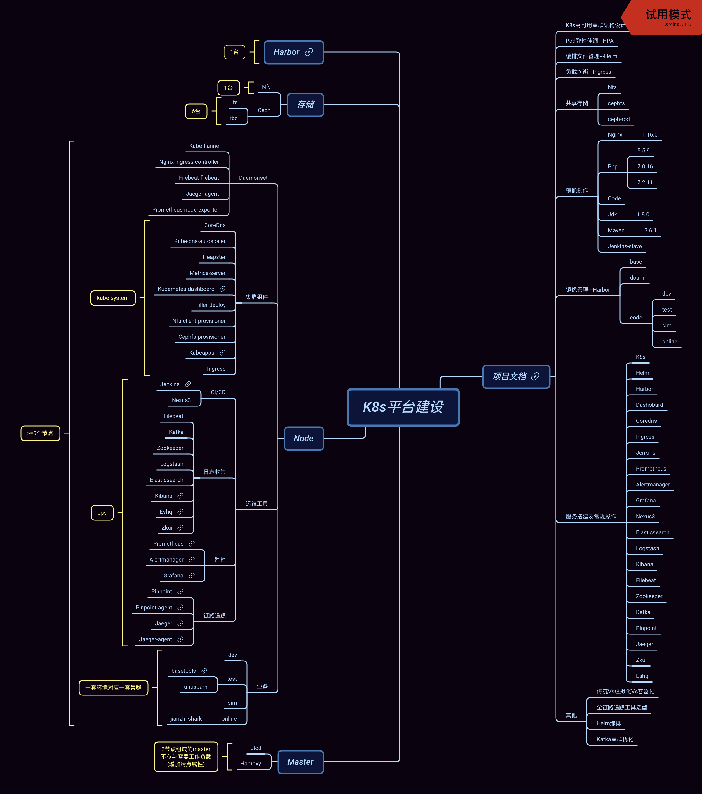
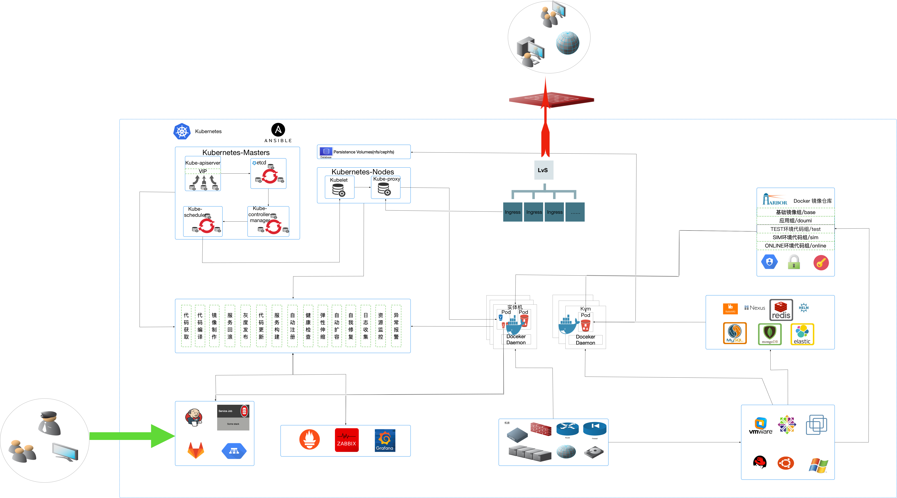
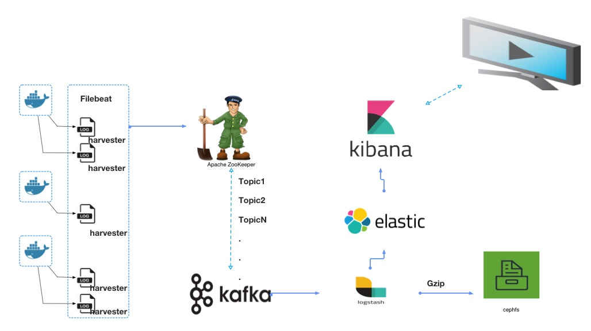

#  容器化改造

# 容器到底是什么？

容器是基于image(镜像)运行的”隔离”环境，相同容器可以并存在同一服务器上；在底层系统一致的情况下，能够快速启动服务、保障服务可用性；

# 容器的构成

运行容器我们需要一个操作系统、镜像、docker服务

- Ubuntu/Centos/Windows目前都支持
- 镜像：使用Dockerfile定义镜像内容包含代码、运行环境所需的依赖软件，打包成一个标准单元；
- Docker服务：配合镜像运行容器的载体;

# 容器能解决什么？

- Docker是运行容器化环境的载体，目前是世界比较领先的容器平台；
- 由Go开发的一款基于Linux内核cgroup、namespace及AUFS类的UnionFS等技术对进程进行封装隔离，从操作系统层进行虚拟化；
- 能够启动重复服务，快速构建开发、测试、预上线多类环境；
- 标注化单元，使得启动的容器具有服务唯一性，在交付过程中能够快速回滚到可用版本；
- 能够在短时间内拉起服务（秒、甚至毫秒级别）；
- 能够从一个平台上运行的应用迁移到另一个平台上，且不用担心运行环境无法正常运行的情况；
- 在接口遇到突泉式增长时能够自动伸缩缓解服务承载能力

# 传统Vs虚拟化Vs容器化

| 部署场景 | 依赖     | 服务可部署数量 | 启动时间 | 硬盘使用 | 性能 |
| :------- | :------- | :------------- | :------- | :------- | :--- |
| 传统     | 操作系统 | 因服务而定     | —        | ALL      | 原生 |
| 虚拟化   | 虚拟产品 | 几十个         | 分钟级   | GB       | 弱于 |
| 容器化   | Docker   | 上千个         | 秒级     | MB       | 接近 |

同等资源的机器上，容器的优势不要太强，这就是为什么容器化在业务场景上使用更优于虚拟化，当然虚拟化有的好处是容器目前没做到的（根据用户进行隔离）而容器化是基于不同应用进行的隔离

# 改造前

## 基础服务部署

ansible推送已编译好的php及相关模块工作目录（宿主机部署）

- 优点
  - 快速（省去编译所耗时间）且能保障以此之前扩展功能的可用性
- 缺点
  - 不能清晰的看到php包含哪些扩展及版本信息
  - 扩展版本需要升级时，需要将原扩展进行替换，不能保障可用性
  - 新增扩展或升级，确认可用后需批量推送

## 代码迭代

开发人员更新代码至Gitlab后登陆到发布服务器在对应目录进行代码更新，再由运维人员使用ansible及crontab或配合手动进行同步下发

- 优点
  - 满足批量更新代码
- 缺点
  - 每次同步将所有代码均进行同步，如期间有人员进行了其他项目目录误操，下发后影响原正常业务且追溯麻烦
  - 每次发版需运维人员配合完成，随着项目及迭代频率增加会增加运维成本降低效率
  - 无灰度发布环境，每次版本都有存在致命bug的风险，一次将流量切至新版一旦有问题后果不堪设想
  - 无回滚机制无版本控制，如遇以上问题无法快速回滚或进行稳定版本切换

# 改造后

## 基础服务部署

Dockerfile编排制作镜像（容器内部署）

- 优点
  - php及扩展版本清单明了，灵活定制
  - 升级扩展时改变对应版本号即可
  - 新增扩展时可按照安装模版快速新增
  - 保留老版本镜像，升级过程中如遇功能性问题，可快速回归至原可用版本
- 缺点
  - 首次镜像制作时，编译时间所耗较长
  - 如遇网络问题资源无法获取，任务中断
- 优化方案

Base镜像可预先上传至本地Harbor，Php及相关扩展包亦可维护一个soft web，资源通过内网获取

## 代码迭代

Jenkins自动化发布，开发人员更新代码至Gitlab后，通过界面在对应项目下进行（开发/测试/灰度/上线/….）等操作，全程交互自动完成部署无需运维人员干预

- 优点
  - 代码迭代无需运维人员干预，提高工作效率
  - 较全面的权限控制，开发人员仅具有相关项目权限，降低跨项目间误操，避免不避免的麻烦
  - 代码在Gitlab进行版本控制的同时打包进镜像，更好的进行版本控制
  - 可进行多套环境、单一项目进行代码迭代
  - 正式上线前增加强制灰度发布，并做好相关分流策略
  - 正式上线时自动切换全部流量至最新代码版本
  - 正式上线后如遇问题可回滚至原稳定版本
  - 代码更新期间，具有自我检查恢复机制，时刻以保障线上业务为准
- 缺点
  - 运维人员需持续优化Pipeline脚本及保障集群健康

# 项目脑图

# 容器架构图

# 日志收集架构图

<table border="0">
    <tr>
        <td><strong>从零到有</strong></td>
        <td><a href="docs/0_1.md">部署顺序</a></td>
    </tr>
</table>

具体相关功能块的实现参考"项目开展"部分

# 项目开展

<table border="0">
    <tr>
        <td><strong>Kubernetes</strong></td>
        <td><a href="http://git.qq.com/sa/k8s-deployment">集群部署</a></td>
        <td><a href="docs/nfs_storage_class.md">共享存储nfs</a></td>
        <td><a href="docs/ceph.md">共享存储ceph</a></td>
        <td><a href="docs/hpa.md">HPA</a></td>
        <td><a href="docs/helm.md">Helm</a></td>
        <td><a href="docs/ingress.md">Ingress</a></td>
    </tr>
    <tr>
        <td><strong>镜像制作</strong></td>
        <td><a href="docs/img_jenkins-slave.md">Jenkins-slave</a></td>
        <td><a href="docs/img_nginx.md">Nginx-1.16.0</a></td>
        <td><a href="docs/img_php7.0.16.md">Php-7.0.16</a></td>
        <td><a href="docs/img_php7.2.11.md">Php-7.2.11</a></td>
        <td><a href="docs/img_php5.md">Php-5.5.9</a></td>
        <td><a href="docs/img_code.md">Code</a></td>
    </tr>
      <tr>
        <td></td>
        <td><a href="docs/img_jdk1.8.0.md">Jdk-1.8.0</a></td>
        <td><a href="docs/img_maven.md">Maven</a></td>
        <td></td>
        <td></td>
        <td></td>
        <td></td>
    </tr>
    <tr>
        <td><strong>服务搭建配置</strong></td>
        <td><a href="docs/jenkins-master.md">Jenkins</a></td>
        <td><a href="docs/monitoring.md">Monitoring</a></td>
        <td><a href="docs/harbor.md">Harbor</a></td>
        <td><a href="docs/nexus3.md">Nexus3</a></td>
        <td><a href="docs/efk.md">EFK+kafka+logstash</a></td>
        <td></td>
    </tr>
    <tr>
        <td><strong>应用操作</strong></td>
        <td><a href="docs/use_jenkins.md">Jenkins</a></td>
        <td><a href="docs/use_prometheus.md">Prometheus</a></td>
        <td><a href="docs/use_alertmanager.md">Alertmanager</a></td>
        <td><a href="docs/use_grafana.md">Grafana</a></td>
        <td><a href="docs/use_efk.md">EFK+kafka+logstash</a></td>
        <td></td>
    </tr>
    <tr>
        <td><strong>其他</strong></td>
        <td><a href="docs/logrotate.md">日志切割</a></td>
        <td><a href="http://git.qq.com/k8s-pipeline/blob/devlop/scripts/Jenkinsfile">Jenkins-Pipeline脚本</a></td>
        <td><a href="docs/传统Vs虚拟化Vs容器化.md">传统Vs虚拟化Vs容器化</a></td>
        <td><a href="docs/容器化架构设计.pptx">容器化架构设计ppt</a></td>
        <td><a href="docs/链路追踪.md">链路追踪选型</a></td>
        <td></td>
    </tr>
</table>

