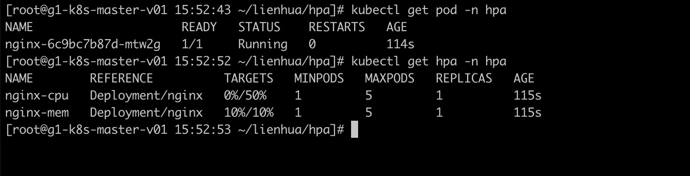
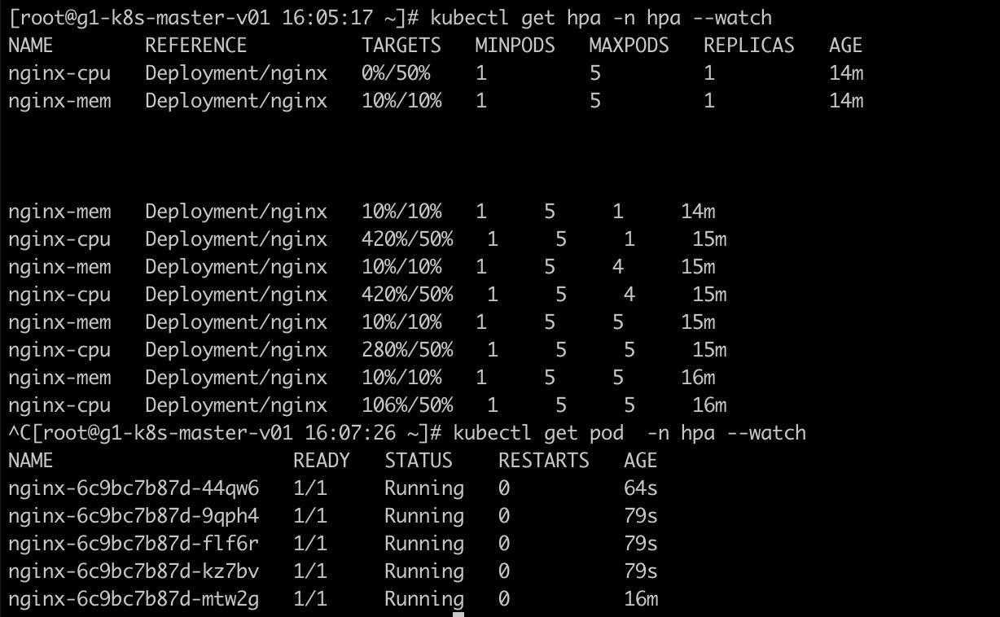

# HPA

HPA(Horizontal Pod Autoscaling)水平自动扩展Pod功能，它能够探测容器内部资源使用情况，根据预期定义的规则进行自动弹性伸缩；

工作目录处于[hpa](hpa)，下面演示下其功能

```
# 启动服务
kubectl create -f ./
```

## 初试状态

看看创建后现在的状态

包含一个Pod

cpu使用率为0%当超过50%时进行扩容，最大扩容到5个

mem使用率为10%当超过10%时进行扩容，最大扩容到5个




## 提高资源使用率

现在手动提高资源使用情况

```
while true; do curl 172.16.49.102;done
```

看看现在的状态

随着cpu压力的上升，Pod数量由1个逐步扩容到5个




## 降低资源使用率

停止刚才的命令，可以看到现在的状态

压力下来后，Pod数量又恢复到1个


以上是对于HPA的功能实现，具体会渗透在每个项目中，需要注意的是mem和cpu控制的max数量不要一样，否则会出现负载下来后，销毁Pod的瞬间，又会启动Pod