# Jenkins-master

# 安装

目录文件处于 [jenkins](./jenkins)

1. jenkins安装方式比较多样化，具体可以参考[Jenkins官网](https://jenkins.io/zh/doc/book/installing/)，我们这里使用K8s集群容器化部署服务，所以我们在开始之前需要有一套k8s集群环境，接下来看启动服务的相关文件

   ```
   # pv文件(jenkins-pv.yaml)
   ---
   kind: PersistentVolumeClaim
   apiVersion: v1
   metadata:
     name: jenkins-pvc
     annotations:
       volume.beta.kubernetes.io/storage-class: "managed-nfs-storage"
   spec:
     accessModes:
       - ReadWriteMany
     resources:
       requests:
         storage: 200Gi
         
   # harbor认证信息(jenkins-configmap.yaml)
   ---
   apiVersion: v1
   kind: ConfigMap
   metadata:
     name: dockerhub
   data:
     dockerhub.config: |
       {
               "auths": {
                       "10.16.200.119": {
                               "auth": "YWRtaW46SGFyYm9yMTIzNDU="
                       }
               },
               "HttpHeaders": {
                       "User-Agent": "Docker-Client/18.09.2 (linux)"
               }
       }
         
   # 主程序文件（jenkins-master.yaml）
   ---
   apiVersion: extensions/v1beta1
   kind: Deployment
   metadata:
     name: pro-jenkins
   spec:
     replicas: 1
     template:
       metadata:
         labels:
           run: pro-jenkins
       spec:
         containers:
         - name: jenkins
           image: jenkins/jenkins
           imagePullPolicy: IfNotPresent
           env:
           - name: JAVA_OPTS
             value: '-Duser.timezone=Asia/Shanghai'
           ports:
           - containerPort: 8080
             name: web
           - containerPort: 50000
             name: agent
           volumeMounts:
           - name: workspace
             mountPath: /var/jenkins_home
         volumes:
           - name: workspace
             persistentVolumeClaim:
               claimName: jenkins-pvc
         dnsConfig:
           options:
            - name: ndots
              value: "1"
   
   ---
   apiVersion: v1
   kind: Service
   metadata:
     name: pro-jenkins
     labels:
       run: pro-jenkins
   spec:
     type: NodePort
     selector:
       run: pro-jenkins
     ports:
     - name: web
       port: 8080
       nodePort: 31080
     - name: agent
       port: 50000
       nodePort: 31050
   
   ---
   apiVersion: extensions/v1beta1
   kind: Ingress
   metadata:
     name: ingress-jenkins
   spec:
     rules:
     - host: jenkins.ingress.com
       http:
         paths:
         - path: /
           backend:
             serviceName: pro-jenkins
             servicePort: 8080
   ```

   - `jenkins-pv.yaml` 创建一个pvc作为数据持久化所用，主要注意volume.beta.kubernetes.io/storage-class参数需要与Storageclass的名称对应；
   - `jenkins-master.yaml` 定义使用pvc；nodePort申明端口，部署后通过http://$cluster_ip:nodePort进行服务访问；当集群使用ingress服务时，创建ingress规则可以通过http://jenkins.ingress.com进行访问；

   - 调整jenkins-configmap.yaml

     ```
       docker login Harbor_ip:Port
       #会生成登陆Harbor登陆密钥在~/.kube/config文件
     
       #将~/.kube/config内容替换至dockerhub.config下
     ```

- 注意事项
  无论hostPath方式还是pvc方式存储数据，均需给对应目录Jenkins权限，默认jenkins用户uid:gid为1000,动态pv的话则无需处理

  ```
    chown -R 10000:10000 Work_dir
  ```

  `Work_dir:` Jenkins工作目录


2. 启动服务

   ```
   # 启动
   kubectl create -f jenkins-pv.yaml
   kubectl create -f jenkins-master.yaml
   kubectl create -f jenkins-configmap.yaml
   ```


# 初始化

- 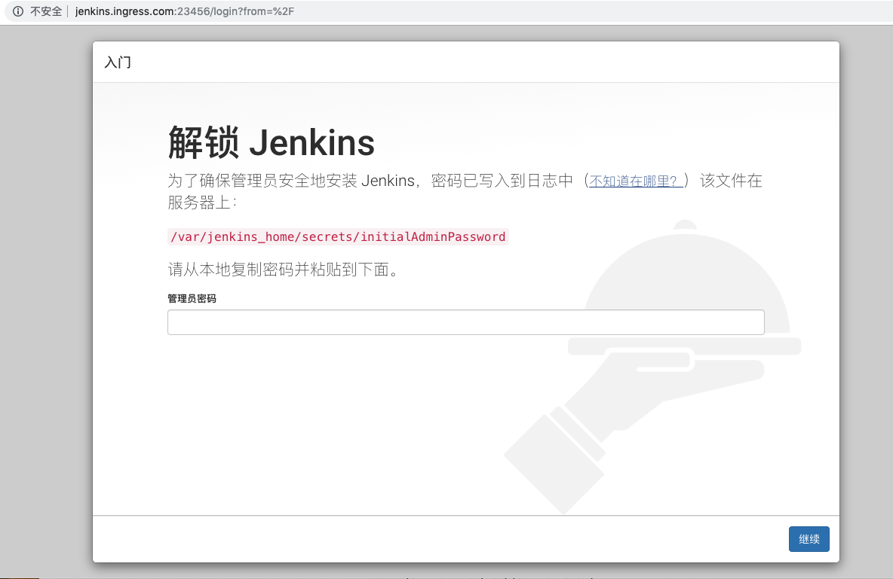

  ```
  # 在之前定义的共享存储目录下获取
  cat secrets/initialAdminPassword
  d777b3a282szks2bfd28a16c8dd61ds
  ```

- 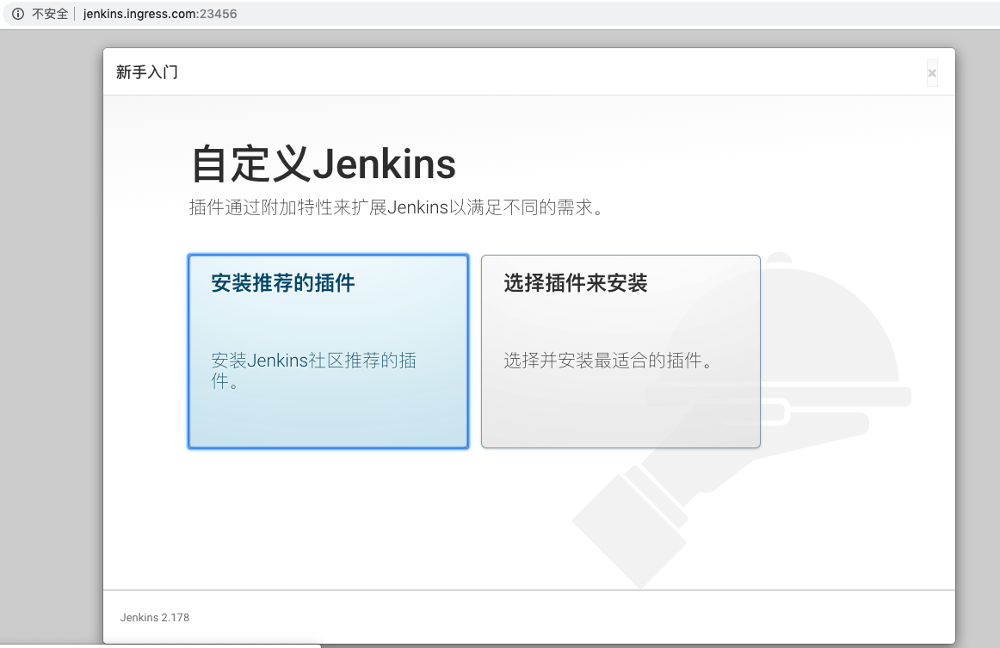

  选择"安装推荐的插件"下一步

- 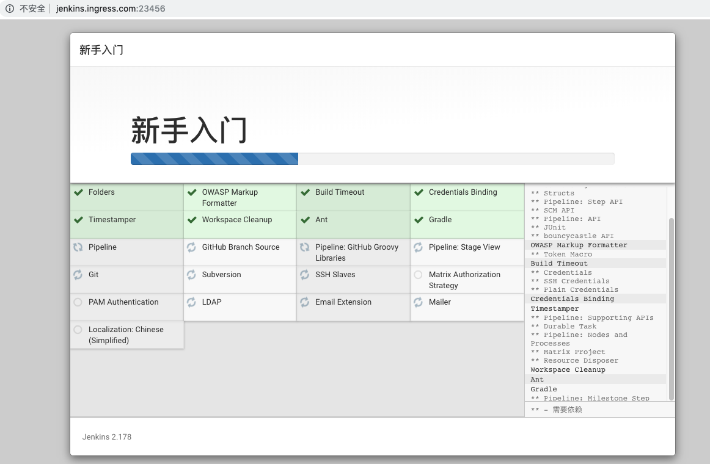

  等待片刻

- 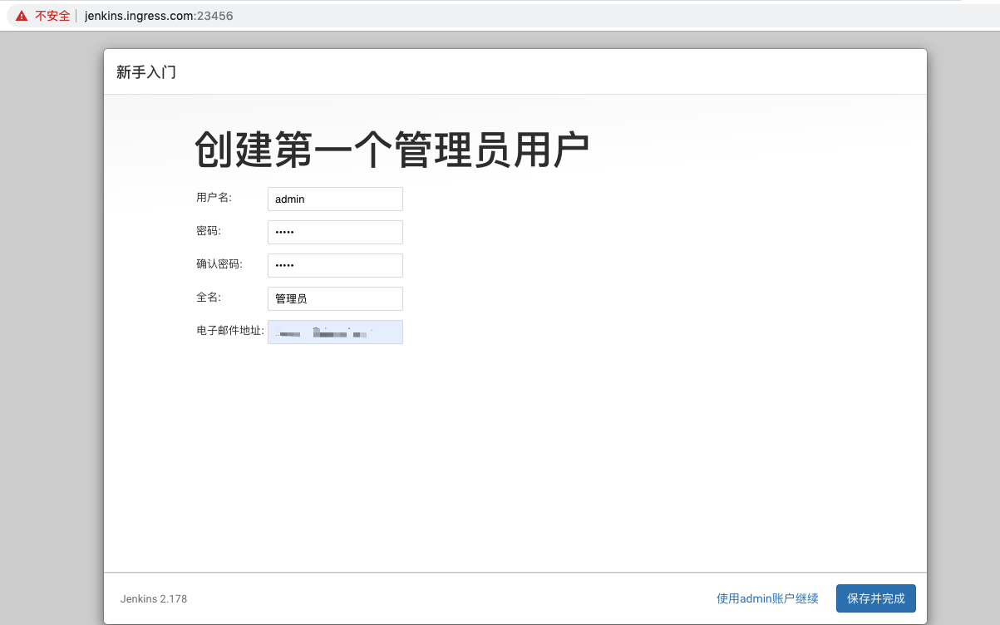

  定义管理员账号信息

- 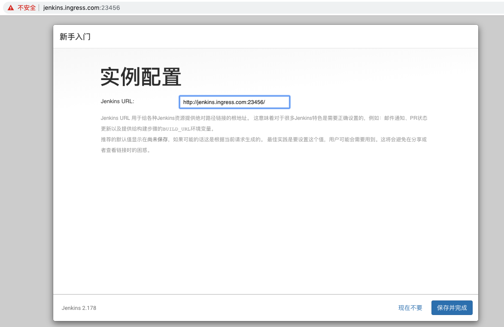

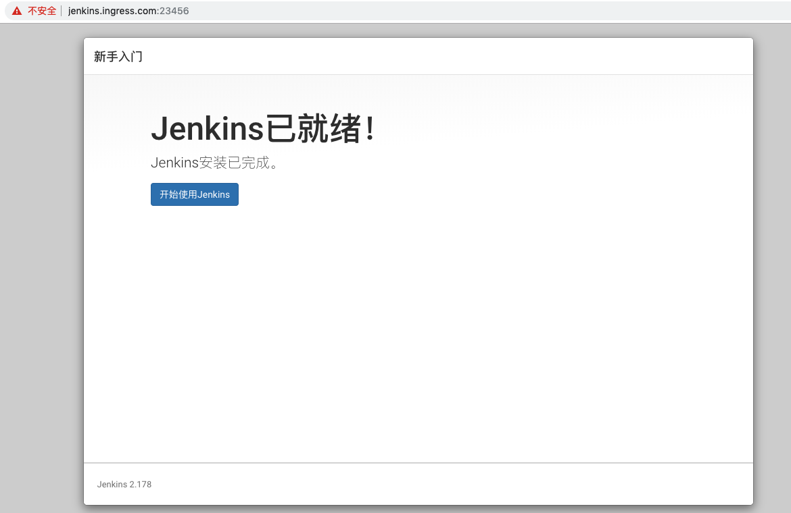

初始化完毕


# 插件安装配置

"Manage Jenkins"->"Manage Plugins"->"Available" 进行插件安装

## Pipeline

代替传纯统工作模式，提高脚本复用性，在项目中定义所有项目逻辑，安装即可支持此工作模式，无需配置

## Kubernetes

用于识别k8s集群并调用其相关接口进行Job发布

"系统管理"->"系统管理"->"云"->"新增一个云"->"Kubernetes"

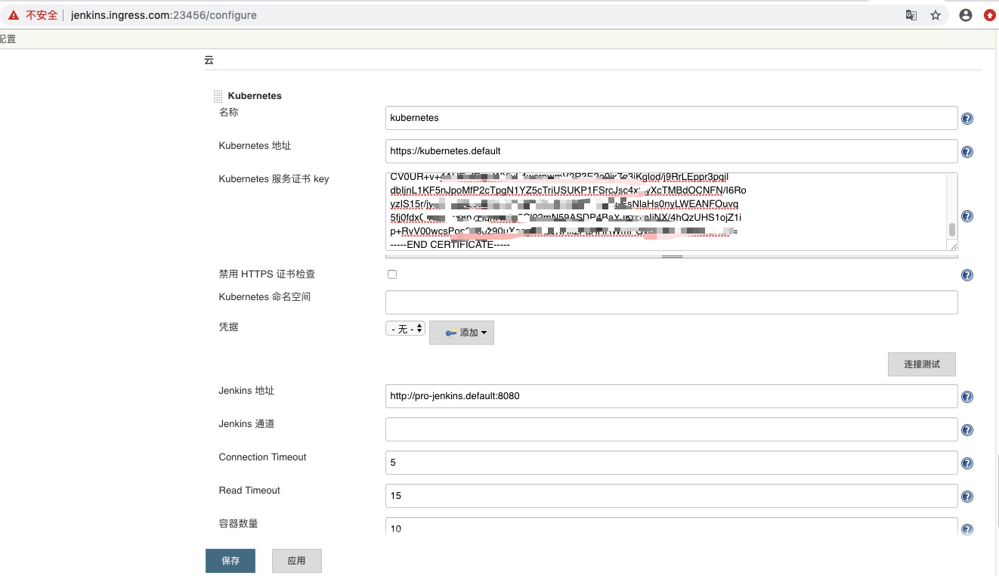

`名称` 自定义即可

`Kubernetes 地址` kubectl get svc查看解析，其中default代表的namespace；

`Kubernetes 服务证书key` kubernetes集群的ca证书，通常在/etc/kubernetes/ssl/ca.pem

`Jenkins 地址` kubectl get svc查看jenkins的解析，其中default代表的namespace；

`凭据` 用于连接配置的Kubernetes集群后接口调用

```
echo “kubeconfig下certificate-authority-data” | base64 -d > /tmp/ca.crt
echo “kubeconfig下client-certificate-data” | base64 -d > /tmp/client.crt
echo “kubeconfig下client-key-data” | base64 -d > /tmp/client.key
# 生成client p12认证文件并下载到本地，执行下面命令时会让输入密码，需要输入后面使用
openssl pkcs12 -export -out ./cert.pfx -inkey ./client.key -in ./client.crt -certfile ./ca.crt
```

新增凭据，将生成的cert.pfx上传，并输入刚才的密码

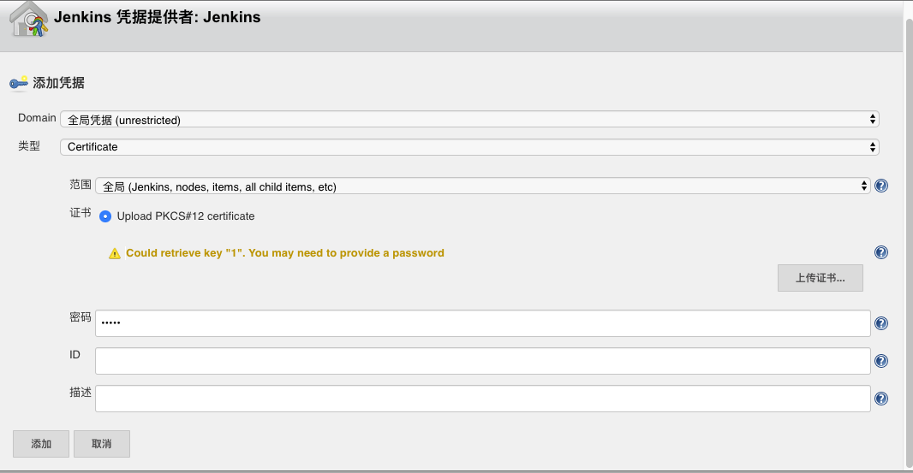

 添加完毕后可以点击链接测试，返回"success"则配置成功

## Maven Integration Plugin

编译java所用，同时可以提供pipeline内对docker镜像编译、上传等操作，由于此项目主要针对php且docker这块直接调用的api,所以先暂时不介绍插件，配置略

## Blue ocean

提供更好看的Web界面，用于任务触发、便于查看任务进度日志等，安装即可无需配置

## Ssh

用于连接到需要操作的节点，在传统使用Jenkins时必不可少的一个插件，此项目中没有用到，配置略

## Active choices

用于发布服务时的联动及分选，可限制可选参数，降低人员对于项目的误操作


## Gitlab

用于在执行任务中获取项目repo

"系统管理"->"系统管理"->"Gitlab"

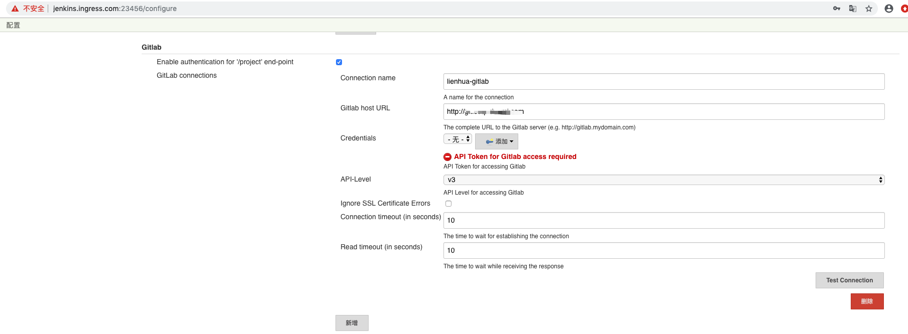

`connection name` 自定义名称

`Gitlab host URL` 需连接的gitlab主地址

`API-Level` 这块一定要选择v3，否则会报错Client error: HTTP 401 Unauthorized

`Credentials` 用于连接此gitlab的token

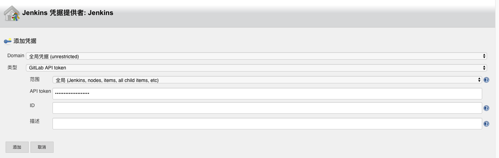

点击"Test connection"进行测试，返回"success"则配置成功


# 创建项目

### 创建一个项目为"lienhua"

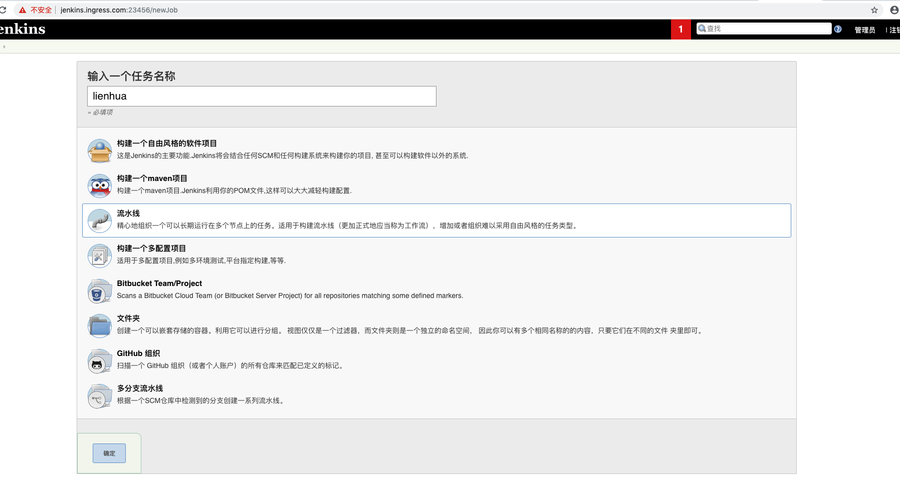


### 配置"参数化构建过程"，实现关联参数功能

"添加参数"->"Active Choices Parameter"

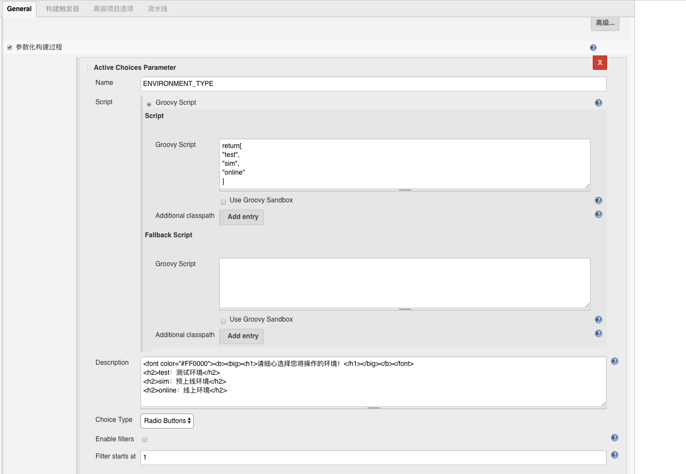

`Name` 变量名称

`Groovy Script` 内容定义了3个环境

`description` 注释定义了三个环境

`Choice Type` 选择Radio Buttons


"添加参数"->"Active Choices Reactive Parameter"

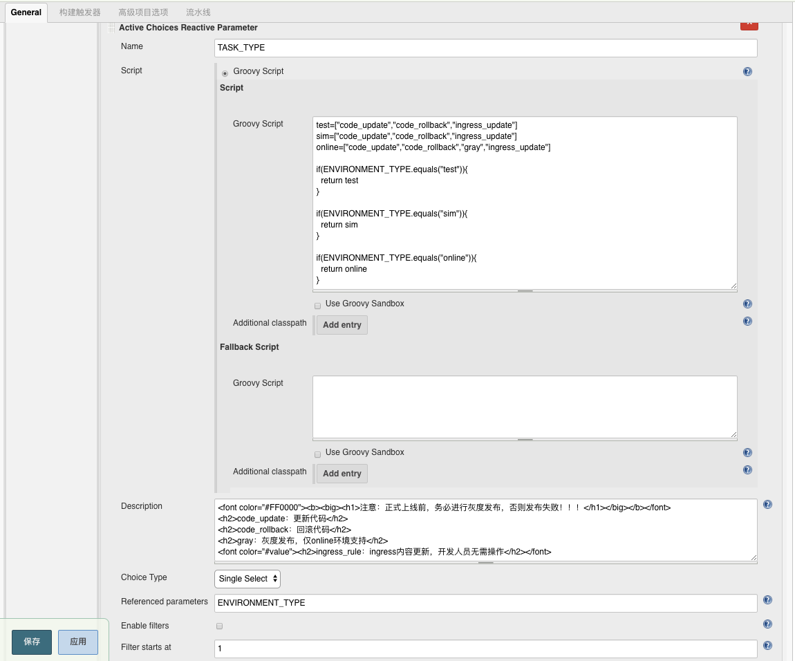

`Groovy Script` 关联三套环境可选择的操作（开发和测试环境支持更新和回滚，上线操作支持更新、回滚及灰度发布）

`Referenced parameters` 定义引用的参数


"添加参数"->"Active Choices Reactive Parameter"

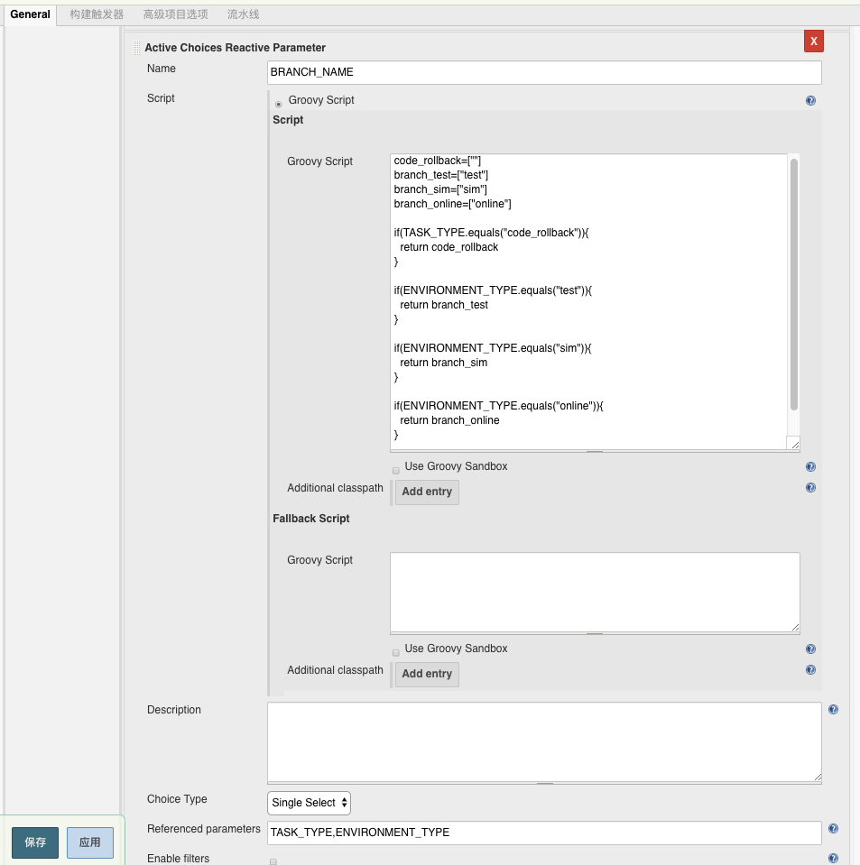

`Groovy Script` 关联三套环境操作时使用的分支（dev/test/master），当操作为回滚时，分支为空即可

`Referenced parameters` 定义引用的参数，多个参数时用逗号隔开


"添加参数"->"Active Choices Reactive Parameter"

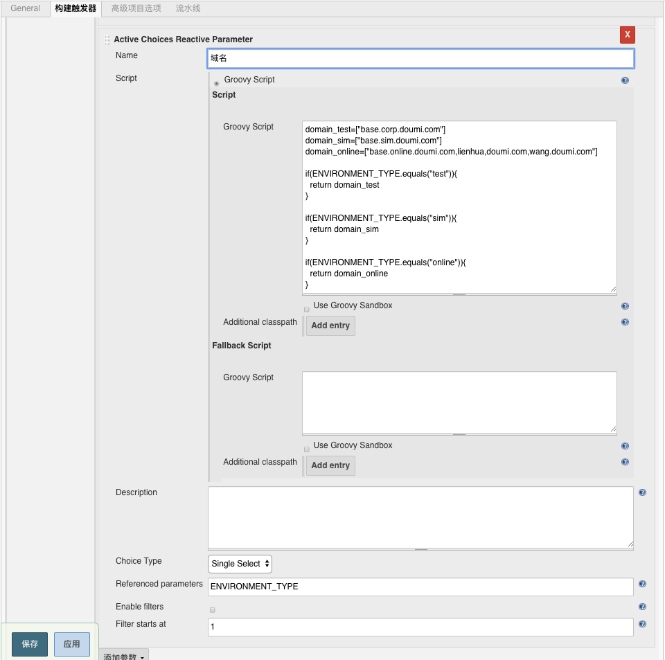

此项定义项目对应的域名，便于跟踪


### 定义流水线


`定义` 选择Pipeline script from SCM

`SCM` 选择Git

`Repositories` 填写存放pipeline脚本的git仓库地址

`Branchs to build` 定义获取使用的分支

`Credentials` 用于获取此repo的ssh-key，一定确保此key具有pull权限

`Additional Behaviours` 拽取下来的代码命名为jenkins

`脚本路径` Jenkinsfile在repo的相对位置


# Jenkins逻辑

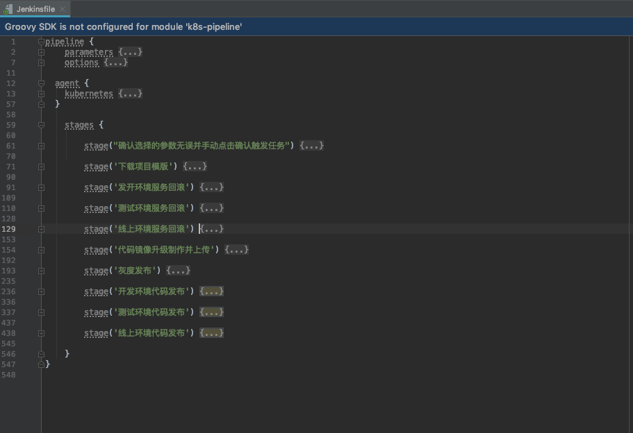

# 构建项目

"Build with Parameters" 选择预发布的环境点击"开始构建"即可

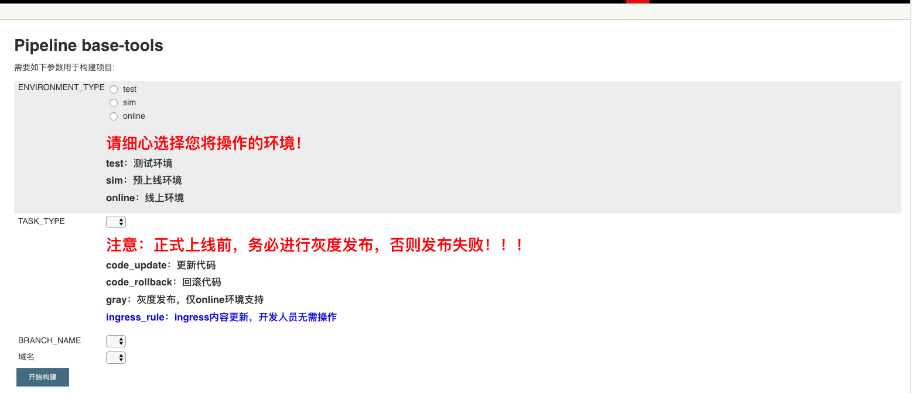

可点击"Blue Ocean"进行任务发布进度情况

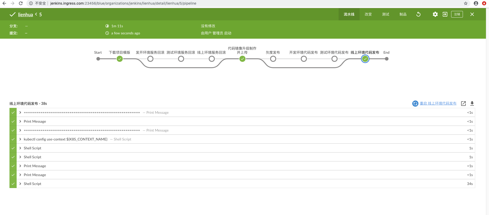


