# Nexus3

[官网](https://help.sonatype.com/docs)

# 安装

使用的官方镜像[sonatype/nexus3](https://hub.docker.com/r/sonatype/nexus3/)，将其推至Harbor

```
docker tag sonatype/nexus3 10.16.200.119/xxxx/nexus3
docker push 10.16.200.119/xxxx/nexus3
```

Deploy.yaml

```
---
kind: PersistentVolumeClaim
apiVersion: v1
metadata:
  name: nexus-pvc
  annotations:
    volume.beta.kubernetes.io/storage-class: "managed-nfs-storage"
spec:
  accessModes:
    - ReadWriteMany
  resources:
    requests:
      storage: 200Gi
---
apiVersion: extensions/v1beta1
kind: Deployment
metadata:
  name: nexus
spec:
  replicas: 1
  template:
    metadata:
      labels:
        run: nexus
    spec:
      containers:
      - name: nginx
        image: 10.16.200.119/xxxx/nexus3
        imagePullPolicy: Always
        ports:
        - containerPort: 8081
          name: web-port
        volumeMounts:
        - name: data
          mountPath: /nexus-data
      volumes:
        - name: data
          persistentVolumeClaim:
            claimName: nexus-pvc
---
apiVersion: v1
kind: Service
metadata:
  name: nexus
  labels:
    run: nexus
spec:
  ports:
  - name: web-port
    port: 8081
    targetPort: 8081
  selector:
    run: nexus

---
apiVersion: extensions/v1beta1
kind: Ingress
metadata:
  name: nexus
  labels:
    run: nexus
  annotations:
    kubernetes.io/ingress.class: "nginx"
spec:
  rules:
  - host: nexus.ingress.com
    http:
      paths:
      - path: /
        backend:
          serviceName: nexus
          servicePort: 8081
```


# 初始化配置

默认web端口为8081，登陆的初始账号为admin/admin123

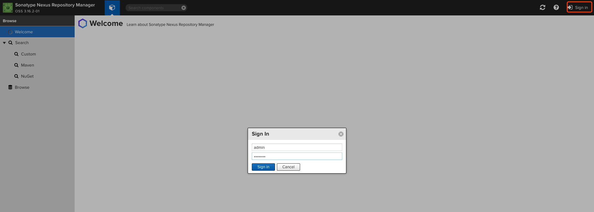

从图中可以看到三种仓库类型：group（仓库组）、hosted（宿主）、proxy（代理）；每种类型的Format分为maven2和nugget，url是仓库的地址，会在我们的项目pom里被使用到；由于我们用到的是maven库所以下面仅针对maven类型进行介绍；

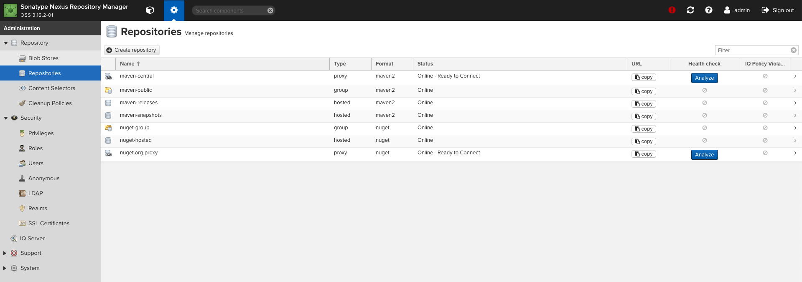


- `maven-central`：这是maven的中心仓库，nexus这里只是做一个代理，最后会转发到maven的central库
  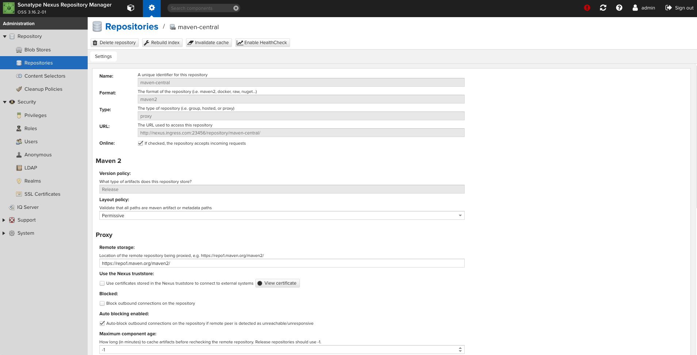


- `maven-public`: 这是一个仓库组，访问这个仓库组的地址其实会访问组内所有仓库
  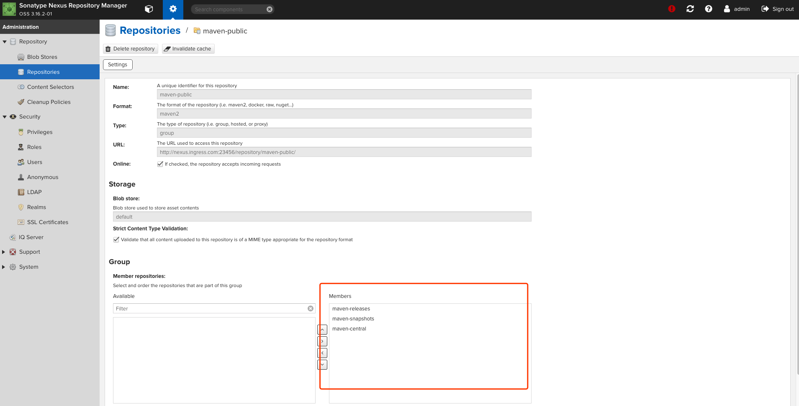


- `maven-release`：这是nexus提供的一个默认的存放release版本jar包的仓库
  
- `maven-snapshots`：这是nexus提供的一个默认的存放snapshot版本jar包的仓库
  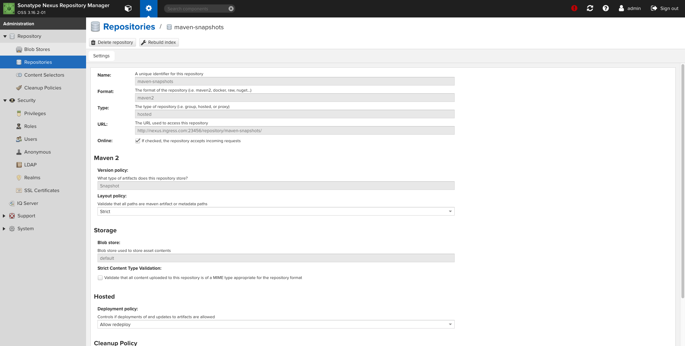


这里我们需要根据自己公司的需要进行仓库的创建

新建库需要注意标红处的内容，`Remote storage`为关联公网的仓库地址，以下我们共创建了6个仓库

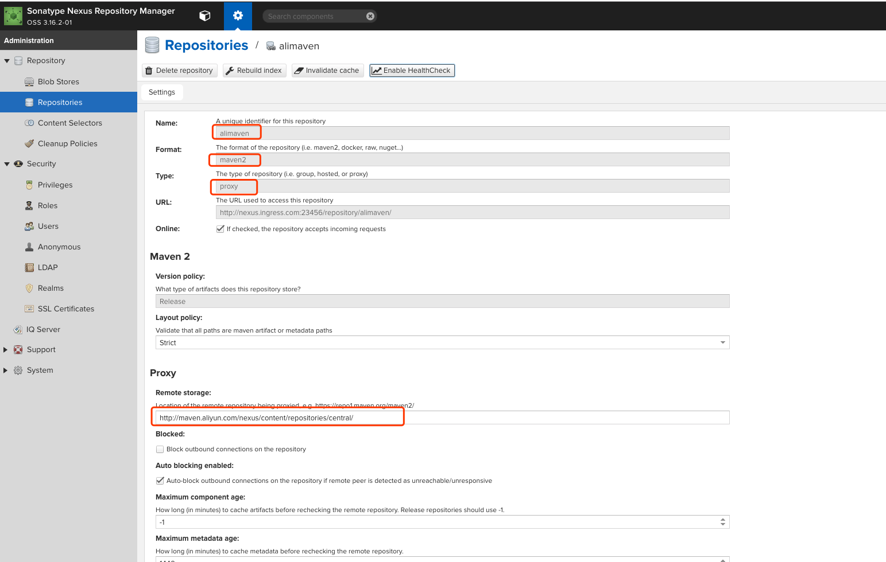

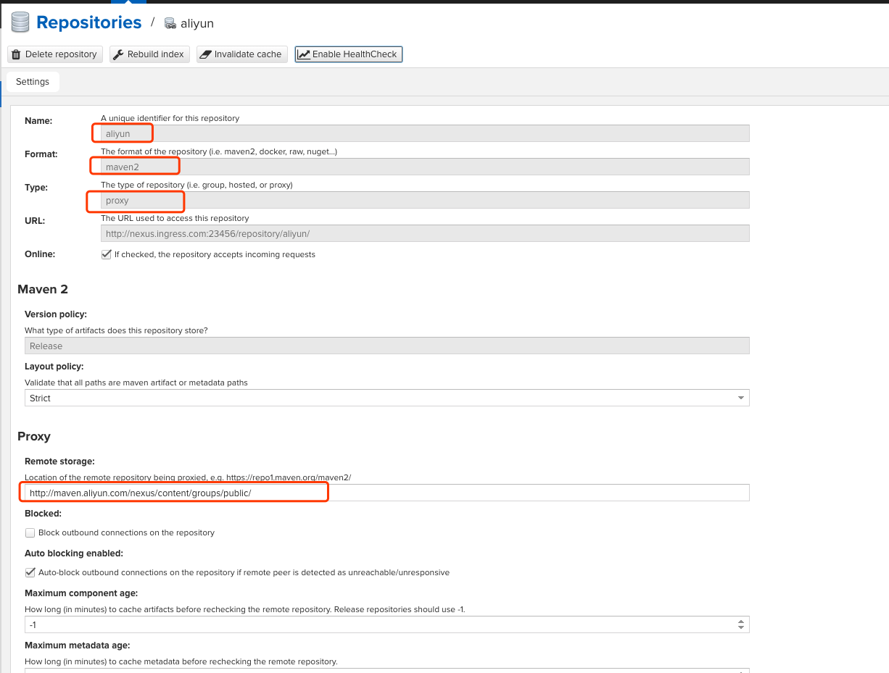

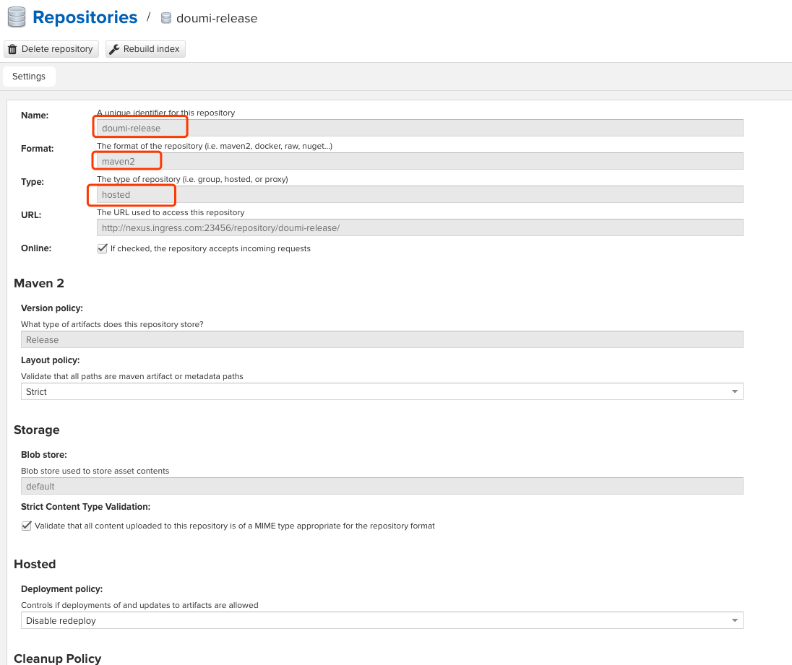

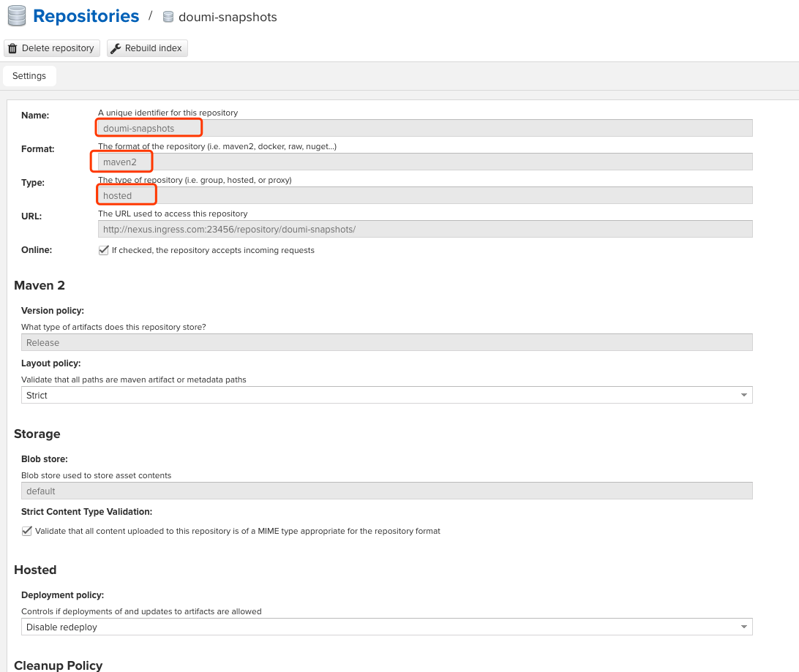

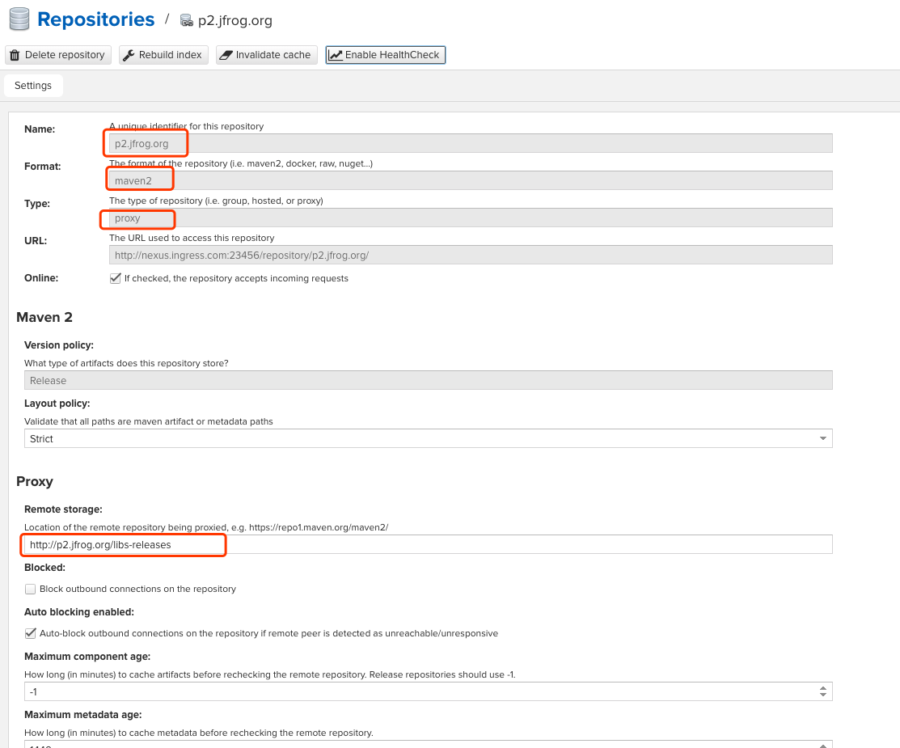

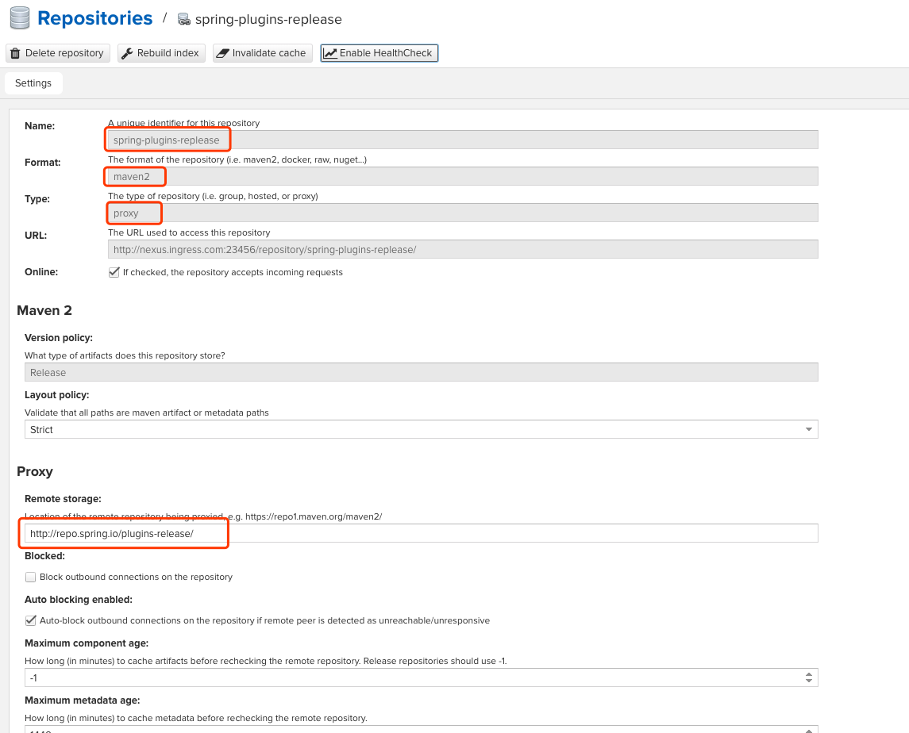


最后我们需要将maven-public关联刚才创建的仓库，需要注意的是此处的URL为maven调用的地址

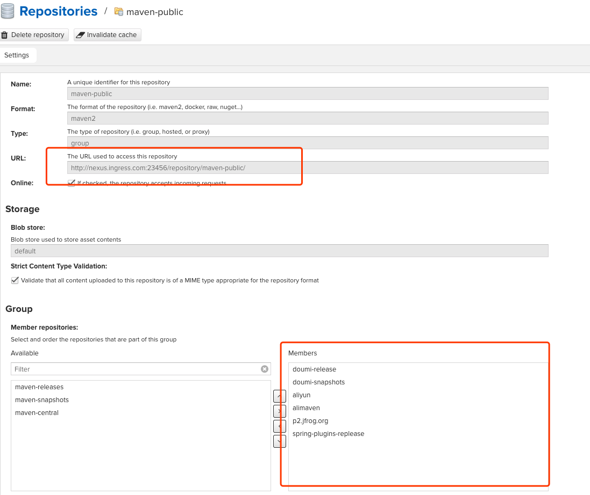


# maven配置使用

修改maven配置文件settings.xml

```
<?xml version="1.0" encoding="UTF-8"?>
<settings xmlns="http://maven.apache.org/SETTINGS/1.0.0"
          xmlns:xsi="http://www.w3.org/2001/XMLSchema-instance"
          xsi:schemaLocation="http://maven.apache.org/SETTINGS/1.0.0 http://maven.apache.org/xsd/settings-1.0.0.xsd">

        <localRepository>/data/maven-nexus/data</localRepository>
    <servers>
        <server>
            <id>xxxx-releases</id>
            <username>jg_deploy</username>
            <password>jg_deploy</password>
        </server>
        <server>
            <id>xxxx-snapshots</id>
            <username>jg_deploy</username>
            <password>jg_deploy</password>
        </server>
    </servers>
    <mirrors>
        <mirror>
            <id>central</id>
            <mirrorOf>central</mirrorOf>
            <name>Nexus Public Repository mirror </name>
            <url>http://nexus3.corp.xxxx.com/repository/maven-public/</url>
        </mirror>
                <mirror>
            <id>nexus</id>
            <mirrorOf>nexus</mirrorOf>
            <name>Nexus Public Repository mirror </name>
            <url>http://nexus3.corp.xxxx.com/repository/maven-public/</url>
        </mirror>
                <mirror>
                        <id>alimaven</id>
                        <name>aliyun maven</name>
                        <url>http://maven.aliyun.com/nexus/content/groups/public/</url>
                <mirrorOf>central</mirrorOf>
    </mirror>
    </mirrors>
</settings>
```

`localRepository` 配置依赖包的下载路径即本地仓库

`server` 配置nexus中央仓库及用户信息

`mirror` 配置仓库源地址，配置nexus是为了解决自己第三方包依赖的问题

