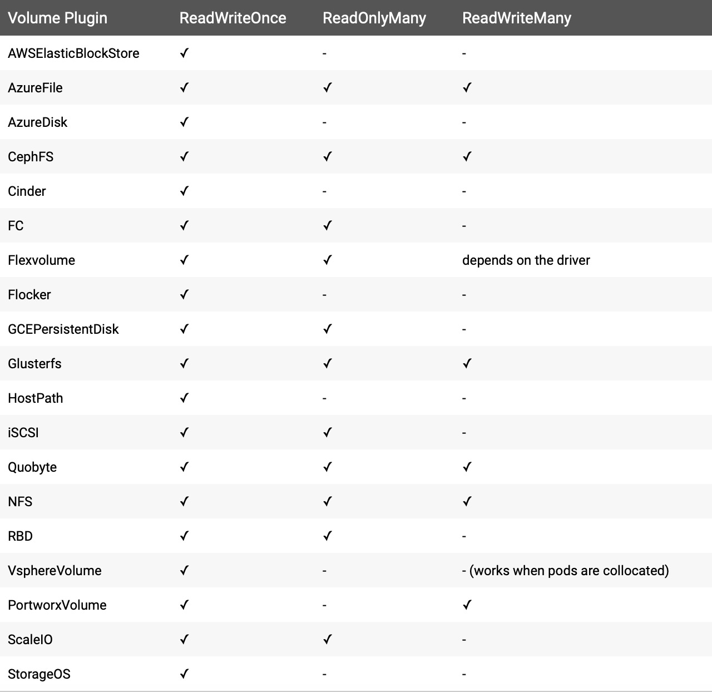

# 共享存储

在K8s集群中有一些有状态的服务它们依赖底层的数据，那么在保证服务的高可用性下，显然Pod的漂移是我们无法提前预知的，那么当它飘逸到一个新的节点时，我们无法确保当前节点下是否包含其所需的基础数据。这时候我们就需要使用共享存储的存在了；

共享存储能够实现集群中所有节点均能请求到同一位置的数据，这样就解决了有状态服务Pod随机漂移而无法获取基础数据的情况；


## Kuberenetes支持的文件存储



综合各围度考虑后，暂时考虑使用Nfs作为Kubernetes的共享存储文件系统


## NFS搭建

```
# 安装基础软件
yum install -y nfs* rpcbind

# 创建共享目录
mkdir -p /data/nfs

# 定义Nfs配置文件（/etc/exports）
/data/nfs 10.16.200.119/24(rw,sync,no_root_squash)
# 共享目录  被允许的客户端IP    权限

# 重启服务
service nfs restart
service rpcbind restart

# 设置为开机自启
systemctl	enable nfs
systemctl	enable rpcbind

# 本地挂载方式
mount -t nfs 10.16.200.119:/data/nfs   /mnt

# 取消挂载
umount /mnt 
umount 10.16.200.119:/data/nfs
```

以下为权限相关参数

- ro                                 只读访问

- rw                                读写访问

- sync                             所有数据在请求时写入共享

- hide                             在NFS共享目录中不共享其子目录

- no_hide                       共享NFS目录的子目录

- all_squash                  共享文件的UID和GID映射匿名用户anonymous，适合公用目录。

- no_all_squash           保留共享文件的UID和GID（默认）

- root_squash              root用户的所有请求映射成如anonymous用户一样的权限（默认）


## 动态pv

K8s支持静态pv和动态pv，动态Pv更高级一些，能够直接通过服务申请即可自行创建相关存储目录，无需人员干预；工作目录处于[nfs_storage_class](nfs_storage_class/)

需要注意的是：

- PROVISIONER_NAME内容要与StorageClass的name相匹配
- NFS_SERVER 为搭建nfs文件系统的ip
- NFS_PATH 为共享目录

```
# 创建服务
kubectl create -f ./
```

